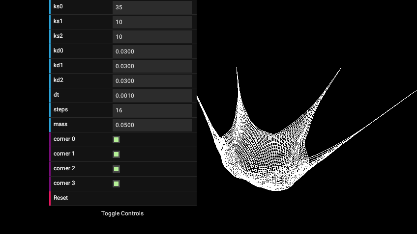
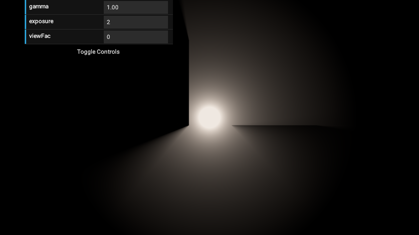

# Tokonoma

Small collection of personal projects related to (mostly real time)
computer graphics, simulation and animation.
Written in C++17, uses Vulkan as graphics api (no other backends, no
huge abstraction layers).
The goal here isn't to write a full graphics engine (although
this repo probably contains lots of typical engine functionality
by now) but rather to develop an environment for extremely quick prototyping
of small, mostly independent 2D and 3D apps for topics I'm currently
interested in.

# Projects

Most of the projects are work in progess and were mainly written for
the purpose of learning and playing around with.
So while they may be useful as a resource of learning,
they usually leave quite some room for improvement. Often, files
(especially the main file of a project) contains various notes, todos and
ideas about what could be done next though (or what is broken at the moment).
List of projects with some sample screenshots (noninclusive):

- automaton: experiments with cellular automata (hexagonal grid)
- bezier: simple playground for bezier curves and anything related to it
- br: minimal gltf pbr forward renderer (including IBL).
  Most other 3D (forward) rendering projects are built from this
- cloth: Simple 3D cloth animation using verlet integration, includes cpu and
  gpu variants.
  
- fluids: fluid simulation on the gpu
  (somewhat outdated, heard a lecture on it since then, to be reworked
  hopefully sooner than later). The screenshot shows the HSV-visualized
  velocity field.
  
- iro: small game idea based on cellular automata.
  Uses the floating point determinism defined by vulkan spirv shaders
  to serialize/synchronize over a small udp protocol (wip).
  
- iv: simple image viewer using the shared image functionality.
  Can view default file types as well as supported KTX files
  (with all mipmaps and array layers). Can also visualize cubemaps.
- lpgi: light probe based global illumination, using spherical harmonics.
  Light probes can be set and refreshed at runtime, simulating
  multiple light bounces
  
- normals: implements the purely 2D normal mapping effect as
  described [here](https://github.com/mattdesl/lwjgl-basics/wiki/ShaderLesson6)
- particles: extremely simple 2D particle system using the mouse
  as attractor. Built for scalability, can run many million particles
  even on not high-end hardware (the screenshot shows
  10 million transparent particles)
  
- pbr: command line utility program for stuff required by the pbr renderer projects,
  like generating cubemaps from equirectangular environment maps, baking irradiance maps or
  specular IBL maps and the brdf lookup table for the split-sum approximation.
  Can also project a cubemap to spherical harmonics coefficients (9x)
- pendulum: simulation of a simple pendulum from an exercise in a
  computational engineering and robotics lecture i heard.
  The challenge is to keep the pendulum standing upwards (unstable stationary
  solution of the underlying differential equation)
  
- pursuers: small system of particle pursuers resulting in interesting
  patterns
  
- sen: first raytracing and path tracing experiments (mainly a cornell-box),
  done via compute shaders (or similar methods) on the gpu.
  Not even physically-based yet, just playing around with the basic concepts.
- shv: visualize spherical harmonics coefficients
- smooth_shadow: analytical 2D smooth shadows via shadow polygons
  
- sss: Comparable to smooth_shadow but uses a subsurface-scattering-like effect
  to achieve smooth shadows, i.e. the strength of light is "reduced" when traveling
  through an object
- deferred: deferred renderer implementing various (mainly screen space)
  effects. Bloom, SSR, SSAO, Luminance based exposure adaption,
  light scattering, simple DOF. HDR pipeline using pbr concepts (for
  lightning, most screen space algorithms are still roughly approximated
  to what looks acceptable. Work in progress)
  
- taa: 3D temporal antialiasing renderer (supporting dynamic scenes)
  playground for different effects that have a synergy with TAA
  (mainly based on noise) like stochastic transparency and noisy shadow
  sampling via a poisson disk
- volume: volume rendering (mainly of 3D functions, no standard
  3D texture/volume file format supported yet) via marching cubes
  

There is some shared code between the projects (like an image loading library,
gltf scene loading and management, various small rendering and computation
helpers as well as general C++ utility that I haven't found a better
place for yet, e.g. 16-bit floats) which is located in the `tkn/`
subfolder, compiled into `libtkn`.

# Screenshots

The gui in all the screenshots uses my (at the time of writing quite
experimental) vulkan-only and retained-mode gui toolkit [vui](https://github.com/nyorain/vui).
As you can see in some screenshots, it includes a component roughly modeled after
the excellent [dat.gui](https://github.com/dataarts/dat.gui).

## Licenses

Unless stated otherwise, the code is available under the MIT license (see LICENSE,
some projects may use GPL, they have their own LICENSE file then).
Additional external licenses for distributed code/assets:

- `assets/LiberationSans-*.ttf`: [SIL Open Font License 1.1](https://scripts.sil.org/cms/scripts/page.php?site_id=nrsi&id=OFL#5667e9e4)
- `assets/Roboto-*.ttf`: [Apache License, Version 2.0](http://www.apache.org/licenses/LICENSE-2.0)
- `assets/OpenSans-*.ttf`: [Apache License, Version 2.0](http://www.apache.org/licenses/LICENSE-2.0)
- `assets/gravel_*`: CC0, from [https://cc0textures.com/view.php?tex=Gravel08](!)

The files in `assets/gltf` have their copyright embedded.

On windows: `meson build/win --default-library static --backend ninja`,
using the latest MinGW. Alternatively, to use dynamic libraries just use
the `flat` layout meson option (since windows can't find the dlls otherwise).
Not always tested for windows, only done once
in a while so the code may have small issues there. But all projects are in general
written in a cross-platform manner so those issues are usually minor things
or related to dependency management.
